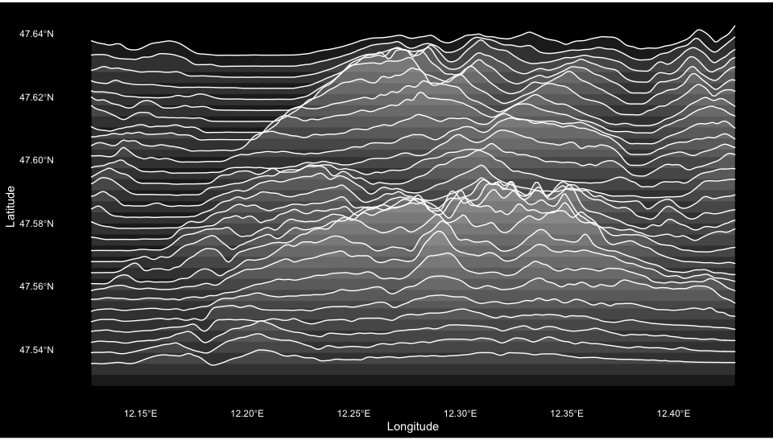
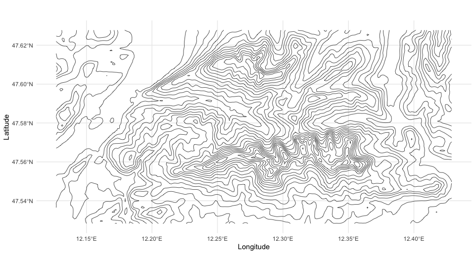

<!-- README.md is generated from README.Rmd. Please edit that file -->

# ridges 

<!-- badges: start -->
<!-- badges: end -->

Download topographical elevation data for any location in the world and
visualize it.

## Installation

You can install the development version of `ridges` from GitHub with:

``` r
# install.packages("remotes")
remotes::install_github("jansim/ridges")
```

## Usage

The package workflow is simple:

1.  Select an area using the interactive map
2.  Get elevation data for that area
3.  Visualize the data

Here’s a basic example of the different kinds of visualizations
available.

``` r
library(ridges)

# We'll use the included elevation data for the Wilder Kaiser mountain range
library(raster)
elevation <- ele_wilder_kaiser

# You can get your own data using the function `get_elevation()` (see below on how to select an area)
# elevation <- get_elevation(bb_wilder_kaiser)

# Create an elevation-based heatmap to check the data
plot_elevation(elevation)
```


``` r
# Create an elevation-based ridgeline plot
plot_ridgelines(elevation)
```



``` r
# Create a contour plot
plot_contours(ele_wilder_kaiser)
```



``` r
# Get the classic Joy Division Album Cover style
plot_ridgelines(
  ele_wilder_kaiser,
  fill_color = NA,
  scale_factor = 12
)
```


``` r
# Vary the styling of the ridgelines
plot_ridgelines(
  ele_wilder_kaiser,
  line_color = "#000000",
  fill_color = "white",
  background_color = "white",
  scale_factor = 8
)
```


``` r
# Get creative!
plot_contours(
  ele_wilder_kaiser,
  color_by_elevation = "both",
  low_color = "#1A237E",
  high_color = "#FF4081"
) + ggplot2::theme_void()
```


``` r
plot_ridgelines(
  ele_wilder_kaiser,
  n_lines = 35,
  line_color = "#FF4081",
  fill_color = "#FF408133",
  background_color = "#1A237E"
)
```


### Getting Your Own Data

For interactive area selection, you can use `draw_bb()` to select an
area on a map in your browser:

``` r
# Open an interactive map to select area
bb <- draw_bb("Innsbruck, Austria") # optionally center on a location

# Get elevation data for the selected area
elevation <- get_elevation(bb)

# Create your own ridgeline plot
plot_ridgelines(elevation)
```

## License

This project is licensed under the MIT License.
